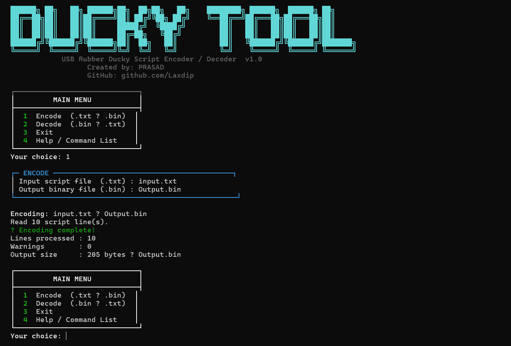
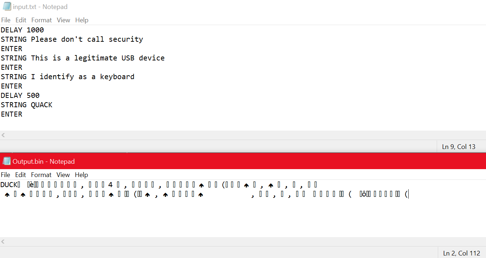
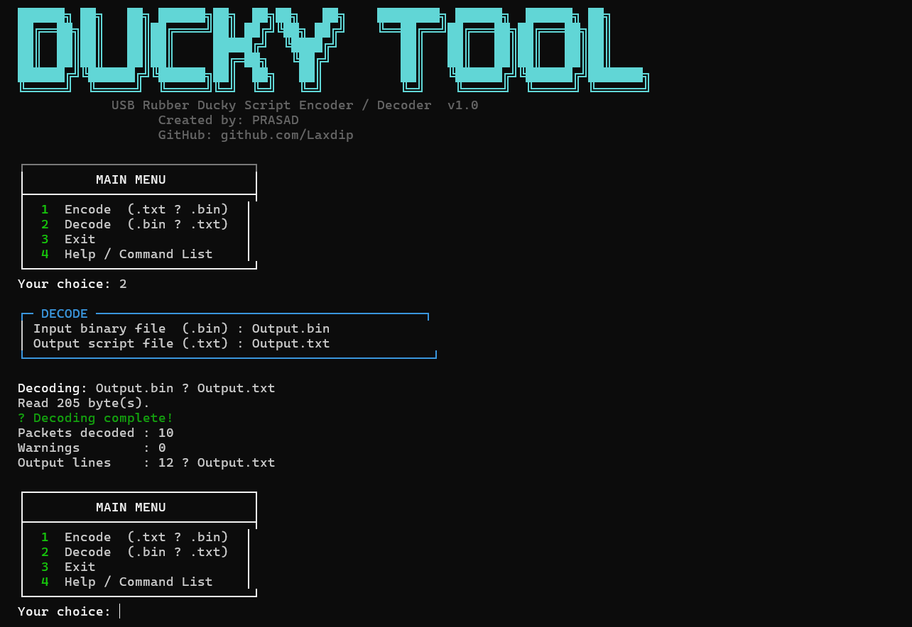
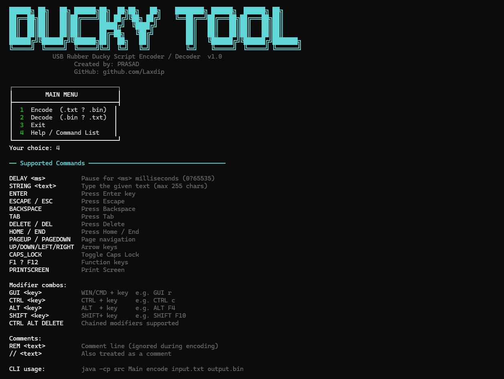

# 🦆 USB Rubber Ducky Encoder/Decoder

A Java tool to encode .txt scripts to .bin payloads and decode .bin back to .txt. Supports DELAY, STRING, ENTER, GUI, CTRL, ALT, SHIFT.

## Run
**Windows:** `run.bat`  
**Linux/Mac:** `./run.sh`  
**Manual:** `javac src/*.java && java -cp src Main`

## 📸 Screenshots

**Encode Process**

**Before vs After**

**Decode Process**

**Help Menu**

## Author
PRASAD
